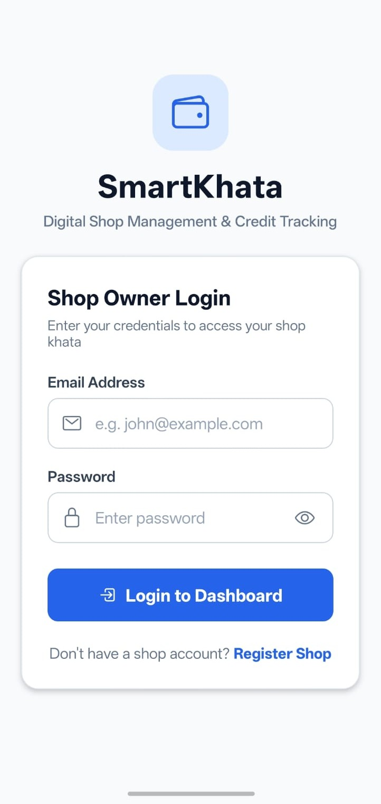
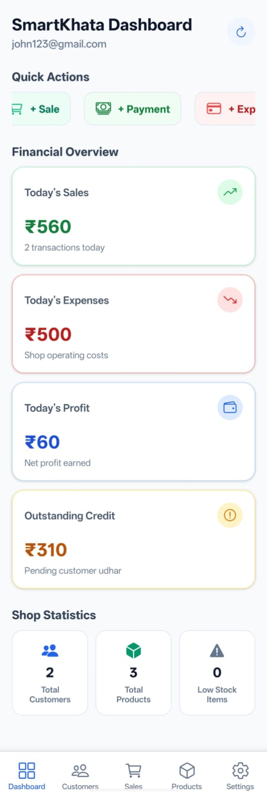
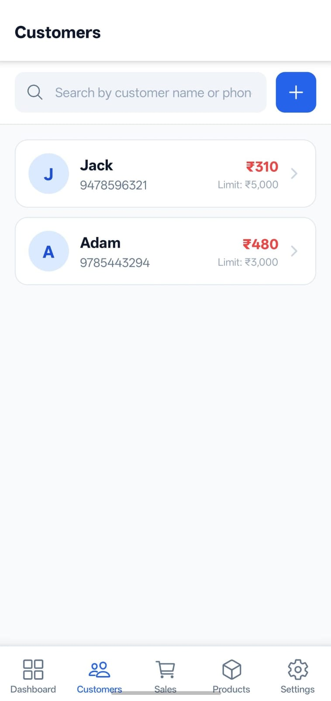
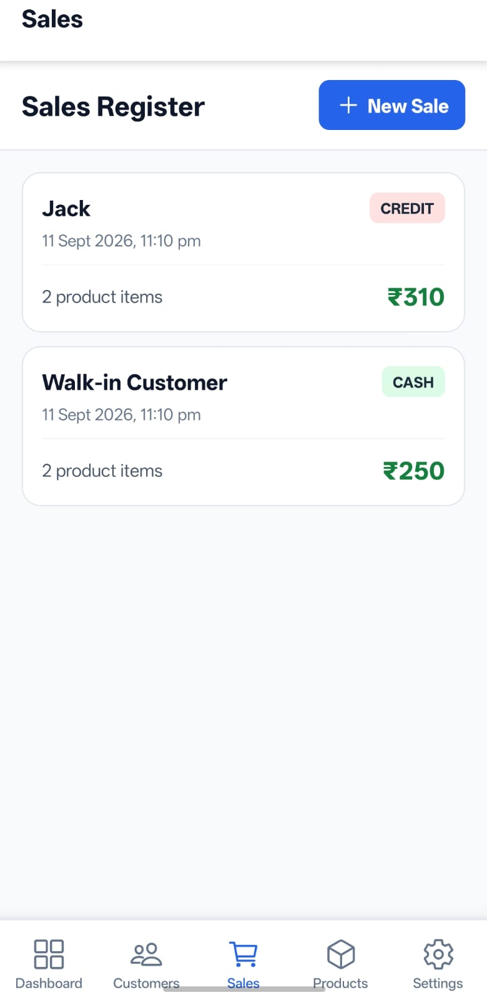

<h1 align="center">SmartKhata</h1>

<p align="center">
  <strong>Digital Credit, Inventory, Sales & Expense Management for Small Businesses</strong>
</p>

<p align="center">
  A mobile-first business management application designed to help small shop owners
  manage customers, credit, inventory, sales, expenses, and daily business operations.
</p>

<p align="center">
  
  
  
  
  
  
</p>

---

## 📱 Overview

**SmartKhata** is a full-stack mobile application built to digitize everyday business management for small shop owners.

Traditional businesses often rely on notebooks to track customer credit, payments, inventory, sales, and expenses. SmartKhata provides a centralized digital solution that makes these operations easier to manage and monitor.

The application consists of:

- 📱 **React Native mobile application**
- ⚙️ **Spring Boot REST API**
- 🗄️ **PostgreSQL database**
- 🔐 **JWT-based authentication**
- ☁️ **Cloudinary integration for media management**

---

## ✨ Features

| Feature | Description |
|---|---|
| 🔐 **Authentication** | Secure registration and login using JWT authentication |
| 👥 **Customer Management** | Create, update, view, and manage customers |
| 💳 **Credit Management** | Record customer credit, payments, and outstanding balances |
| 📖 **Customer Ledger** | View customer transaction history and statements |
| 📦 **Product Management** | Manage products, pricing, and stock |
| 📊 **Inventory Tracking** | Monitor stock levels and identify low-stock products |
| 🛒 **Sales Management** | Create sales containing multiple products |
| 💰 **Payment Tracking** | Support cash and credit-based transactions |
| 🧾 **Expense Management** | Record and categorize business expenses |
| 📈 **Dashboard** | View sales, expenses, profit, credit, customers, and inventory insights |
| 🏪 **Shop Management** | Manage shop and business information |

---

# 📸 Screenshots

## 📸 Screenshots

<p align="center">
  
  
</p>
<br>
<br>
<p align="center">
  
  
</p>
---

## Tech Stack

### Frontend
* React Native
* Expo
* TypeScript
* Expo Router
* NativeWind
* Redux Toolkit
* TanStack React Query
* Axios

### Backend
* Java 21
* Spring Boot 3
* Spring Security
* JWT
* Spring Data JPA
* Hibernate
* Maven

### Database & Services
* PostgreSQL
* Cloudinary
* Git
* GitHub

---

## Architecture

```text
                 ┌──────────────────────┐
                 │   React Native App   │
                 │   Expo + TypeScript  │
                 └──────────┬───────────┘
                            │
                         REST API
                            │
                            ▼
                 ┌──────────────────────┐
                 │    Spring Boot API   │
                 │ Security + JWT + JPA │
                 └──────────┬───────────┘
                            │
                         Hibernate
                            │
                            ▼
                 ┌──────────────────────┐
                 │      PostgreSQL      │
                 └──────────────────────┘
```

---

## Future Enhancements

* Automated payment reminders
* Advanced business analytics
* Detailed reports
* Bill generation and sharing
* Barcode scanning
* Offline-first support
* Cloud synchronization
* Customer credit scoring
* Advanced inventory analytics

---

